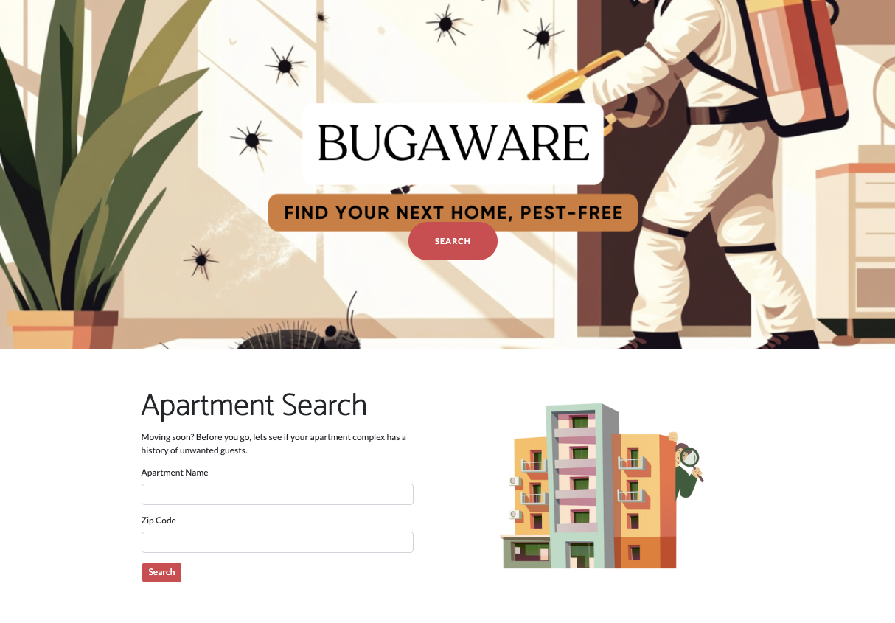
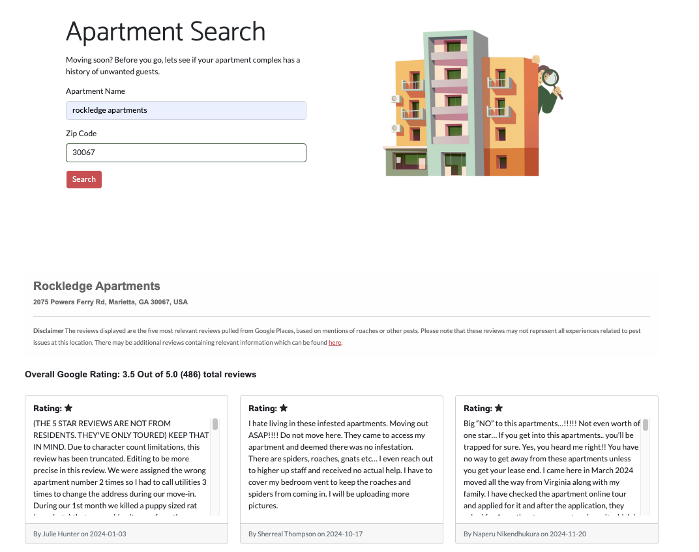

# BugAware 🐜

**BugAware** is a web app designed to help renters make informed decisions when searching for apartments. By analyzing reviews for mentions of pests such as roaches, BugAware provides valuable insights to ensure you find a home that's not just beautiful but also pest-free.

## Features

- **Apartment Insights**: Search for an apartment complex by name and zip code to get detailed feedback from reviews.
- **Pest Mentions Analysis**: Filters reviews for specific mentions of pests, such as roaches, to help you avoid potential issues.
- **Detailed Results**: Provides key details, including:
  - Official apartment name
  - Address
  - Link to the Google page for more information
- **Clear Review Feedback**: Summarized insights on the pest-related reviews for quick and easy understanding.
- **User-Friendly Design**: Built with simplicity in mind, ensuring a smooth and intuitive user experience.

## Screenshots

### Home Screen
  
*A clean and welcoming interface to start your apartment search.*

### Search Results
  
*Detailed apartment information and pest-related review analysis.*

---

## Technology Stack

- **Backend**: Python (Flask)
- **Frontend**: HTML5, CSS3, Bootstrap
- **Database**: None required
- **APIs**: Google Places API for retrieving apartment and review information

---

## How It Works

1. Enter the apartment name and zip code into the search bar on the home screen.
2. BugAware queries Google Places API for relevant data.
3. Reviews are filtered for pest-related keywords (e.g., "roaches").
4. Results are presented with apartment details and review insights.

### Prerequisites

- Python 3.11 or higher
- Google Places API key

### Contributing
Contributions are welcome! If you have ideas or suggestions to improve BugAware, please feel free to submit a pull request or open an issue.
